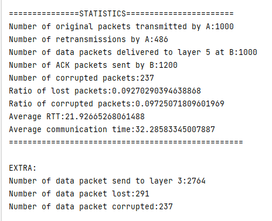

# SR
## how to run
1. change line 189 in Project.java  
`simulator = new SR(nsim, loss, corrupt, delay,trace, seed, windowsize, timeout);`  
2. compile java file `javac *.java`
3. run the project `java -classpath . Project`
4. input parameters according to prompt.

## design
Sender side (A):
1. Buffer to store packet from above
2. Use `aNextSeq` to remember next seq no. Will wrap when equal to 'LimitSeqNo'
3. Restart timer after every `toLayer3`, stop timer when window size = 0
4. Set ack number of packet in the buffer as a flag when received responding ack
5. Send all packets in window when timeout or received new ack
6. Send only next packet when received duplicate ACK

Receiver side (B):
1. Buffer to store packet from A
2. Calculate index of packet based on `bNPE` and `LimitSeqNo` when received packet 
3. If received in-order packet, send packet to layer5, slide the window
4. If received out-of-order packet, save in buffer, send ack according to `bNPE`

## statistics

## Cases
### case1:
your protocol works for no loss + no corruption

### case2:
identify (on output trace) case where ack is lost/corrupted and a later cumulative ack
moves the sender window by more than 1

## case3:
identify (on output trace) case where data packet is lost/corrupted, and data is
retransmitted after RTO

## case4:
identify (on output trace) case where data packet is lost/corrupted, and data is
retransmitted after receiving duplicate ack
*(special case. set average time from layer 5 = 100)*

## case5:
identify (on output trace) case where data packet is lost/corrupted, and the retransmitted
data is delivered and a cumulative ack moves the sender window by more than 1

# GBN
## how to run
1. change line 189 in Project.java  
   `simulator = new GBN(nsim, loss, corrupt, delay,trace, seed, windowsize, timeout);`
2. compile java file `javac *.java`
3. run the project `java -classpath . Project`
4. input parameters according to prompt.

## design
Sender side (A):
1. Buffer to store packet from above
2. Use `aNextSeq` to remember next seq no. Will wrap when equal to 'LimitSeqNo'
3. Restart timer after every `toLayer3`, stop timer when window size = 0
4. Set ack number of packet in the buffer as a flag when received responding ack, also for sack
5. Send packets which don't have ack number (set by sack) in window when timeout or received new ack
6. Send only next packet when received duplicate ACK

Receiver side (B):
1. Buffer to store packet from A
2. Calculate index of packet based on `bNPE` and `LimitSeqNo` when received packet
4. If received in-order packet, send packet to layer5, slide the window
5. If received out-of-order packet, save in buffer, send ack with sack
3. Probe next 5 unACKed packet in window, add sequence numbers to `SACK` in packet

## statistics

## Cases
### case1: 
your protocol works for no loss + no corruption

### case2:
works for loss and no corruption

### case3:
works for no loss and corruption

### case4:
works for both loss and corruption

### case5:
Annotations on traces show difference between SN and GBN+SACK

# statistic analysis
Calculate Throughput, Goodput, average packet delay, SR vs. GBN+SACK under loss or corruption  
Designed function in `Project.java` to run those with 30 different seed.  
Result of Throughput, Goodput, average packet delay  
Each line means: SR under loss, GBN under loss, SR under corrupt, GBN under corrupt, confidence intervals for average delay.

Figures of communication time

