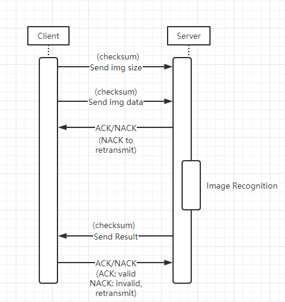
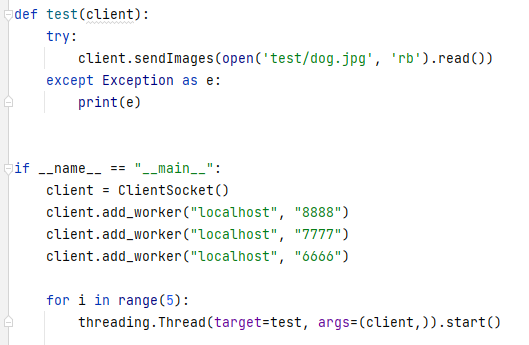
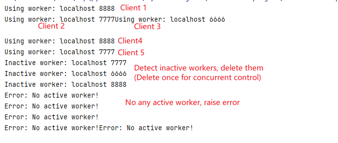
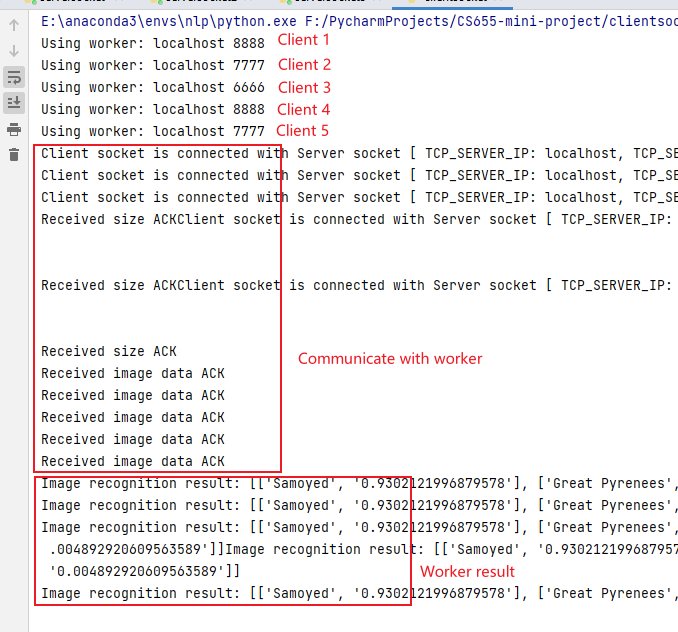

# CS655 GENI Mini Project: Image Recognition Application
Implement an image-recognition service which has a web interface, where a user should be able to submit an image query 
and the service should use any of image recognition techniques, e.g., Squeeze Net, Google Net or any deep learning neural 
network which classifies the image and returns the answer to the user. You don’t need to worry about training the neural 
network and can use pre-trained weights. The web interface and the recognition systems should be on separate nodes, and 
you should connect them using socket programming or rest API

# Demo
Web: http://204.102.244.71:9999/  
(for demo, add/delete worker: 10.10.1.1:8888)
add worker: http://204.102.244.71:9999/add/IP:PORT  
delete worker: http://204.102.244.71:9999/del/IP:PORT  

Video: https://drive.google.com/file/d/1zmoaPUUsQC0rRz1UK-pe7A-Fd0267xXb/view?usp=share_link  

# Design
## 1. Define message format
> < Protocol Type > [ < SPACE >< Data >< SPACE >< Checksum > ]

Protocol Type:  
- ‘D’: Data message, include < Data > and < Checksum >  
- ‘A’: ACK message, exclude < Data > and < Checksum >  
- ‘N’: NACK message, exclude < Data > and < Checksum >  

Data:  
- Payload to send md5 hash or cracked password   

Checksum: (5 bytes: 4 bytes checksum + 1 byte sign)  
- Checksum of data  

## 2. Define socket protocol to transfer image data and result.


## 3. Image recognition model
Used Squeeze Net to do image recognition. The pretrained model is part of pytorch.  
Reference: [SQUEEZENET](https://pytorch.org/hub/pytorch_vision_squeezenet/)

## 3. Implement socket code for server and client
Python socket program.  
`clientsocket.py`  
Read image, send image size and data to server

`serversocket.py`  
Use multi-thread to handle connection. Receive image, image recognize and return result.

## 4. Update worker list on the fly
### Basic concept
Maintain a worker list and current index in ClientSocket.  
Add/delete worker will update worker list.  
Whenever client need to use worker, it will choose one worker according to worker index. Then increase index by one.  
Client has error worker detection. When worker can't respond correctly, client will delete error worker automatically.

### Multi-thread concurrent
Use mutex lock to control concurrent code.  
In particular, use mutex lock when client detect error worker, which need to update list and index, or increase index

## 5. Deploy GUI with Flask
Use Flask to implement simply web ui.  
Html templates: `templates/index.html` and `templates/info.html`   
Flask code: `client.py`

# Requirement
## server
```shell
# install pip3 first
sudo apt update
sudo apt install python3-pip

# prerequisite for Pillow
sudo apt install libjpeg-dev zlib1g-dev
# install python package
sudo pip3 install torch torchvision torchaudio --extra-index-url https://download.pytorch.org/whl/cpu
```

## client
```shell
# install pip3 first
sudo apt update
sudo apt install python3-pip

# install python package
sudo pip3 install Flask
```

# Run
## server
Replace SERVERIP, PORT with your setting
```shell
# run code in terminal
python3 serversocket.py SERVERIP PORT
# or run code at background 
nohup python3 serversocket.py SERVERIP PORT > /dev/null 2>&1 &
```

## client
Replace SERVERIP, PORT with your setting
```shell
# run code in terminal
python3 client.py
# or run code at background 
nohup python3 client.py > /dev/null 2>&1 &
```

# Analysis

## Multi-worker cooperation
Setting: 5 client thread, 3 worker: Worker list [localhost:8888, localhost:7777, localhost:6666]


1. 5 client thread with 3 inactive worker



2. 5 client thread with 3 active worker
