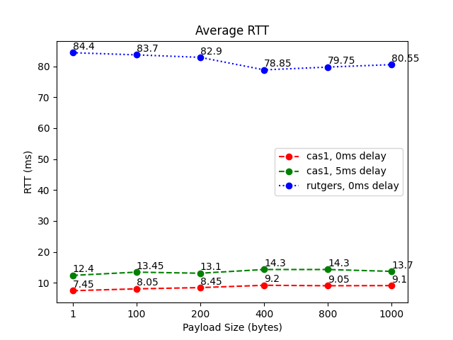

# PA1 part2
Performing RTT and Throughput Measurements.

# server
Use while loop to accept socket connection, create thread to process client request.  
### usage
input port number   
`P2_server [port]`

# client
Send protocol message according to the parameter.  
### usage
input hostname, port, measurement type(rtt or tput), probes number, msg size, server delay(in ms)  
`P2_client [host] [port] [type] [probes] [size] [delay]`

# Experiment

## environment

| S/C     | location                        | machine     | OS      | network          | method                                                                                                                              |
|---------|---------------------------------|-------------|---------|------------------|-------------------------------------------------------------------------------------------------------------------------------------|
| Client  | home                            | laptop      | Windows | Starry (150Mbps) | test rtt and throughput with different message size and server delay. send message for 20 times, record time span for every message |
| Server  | csa1.bu.edu                     | csa1        | Linux   | Unknown          | follow the protocol to response message                                                                                             |
| Server  | pcvm1-1.instageni.rutgers.edu   | Rutgers     | Unknown | Unknown          | follow the protocol to response message                                                                                             |

## RTT result
1. Line is flat, RTT didn't change too much with different payload size
2. Server delay result in larger RTT
3. RTT for Rutgers server is much larger than BU server
4. Transmission time has less effect compared with propagation time.

## Throughput result
1. Line trend is increase. Throughput increase with more payload size
2. Server delay result in smaller throughput, but don't change the trend
3. Throughput for Rutgers server is really low due to large RTT

